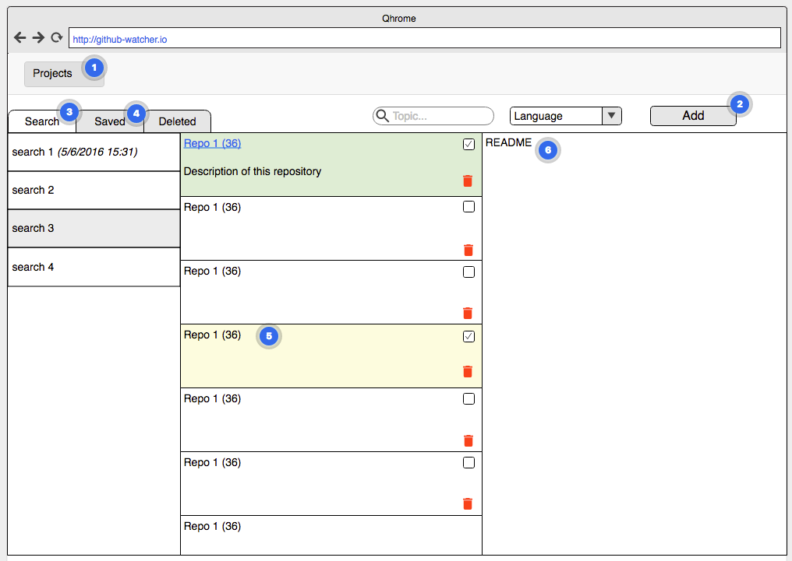

## Introduction

We want to be able to follow up Github repositories for topic linked to projects. We want to get updates about new repositories, and select some for follow up.For that we want to define searches for each project. It should be simple interface (use skeleton css) and simple to use.

https://app.moqups.com/stephane@turfmedia.com/2E2oRf7wJ5/view

## Tasks

* Breakdown project in technical tasks and estimate time in hours for each task. Estimation should be 0.5, 1 or 2 hours. Task that are more than 2 hours should be broken down more. (can be done on trello with trello plus for time est.)
* Code with test and inline documentation
* Deploy to Heroku

## Features

> Numbers are different from the screenshot

1. Use Github Oauth to authenticate users and save projects associated to users.
2. Project: we can choose or create a project
2. For a project we can choose to see searches or saved repositories
3. We can add new search to project by providing search topic(s) and language (optional)
4. After creation of a search it shows it in the list and display results
5. Results are updated repositories since last search (default and max 12 months)
6. Results are ordered by most stared repository first and show repository name, number of stars, description, a checkbox, delete icon.
7. When repository is checked is background color is green
8. If a repository is a saved repository then it is checked and light yellow backgroud
9. We can delete a repository from result, then it will be ignored for any further search of this project
10. If we click on repository its README is displayed in right panel (https://developer.github.com/v3/repos/contents/)
11. When we click on the name of search it refresh the results. We should cache search results fir 24h, not updating search and not updating last seaech time.
12. We should update watched repositories weekly (20 max at the time, need roll update)
13. Use dotenv and dont save any sensitive information to repository (public)

## Data structure

* User Profil
* Projects
* Saved Search for Projects
  * last time search
* Saved / Ignored Repos for Project
* Languages (ruby,go,javascript,rust,java)

## Github App Oauth

Client ID:

Client Secret:

## References

* Github Watcher Gem: https://github.com/sbusso/github-watcher
* Skeleton CSS: http://getskeleton.com/
* Task Board: https://zube.io/boards/60462335/kanban
* Repository: https://github.com/turfmedia/github-watcher-web
